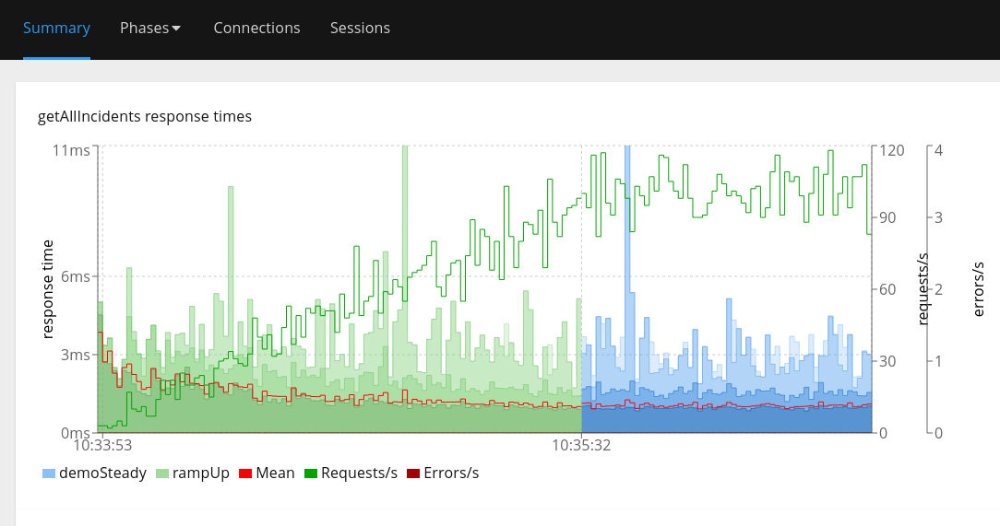
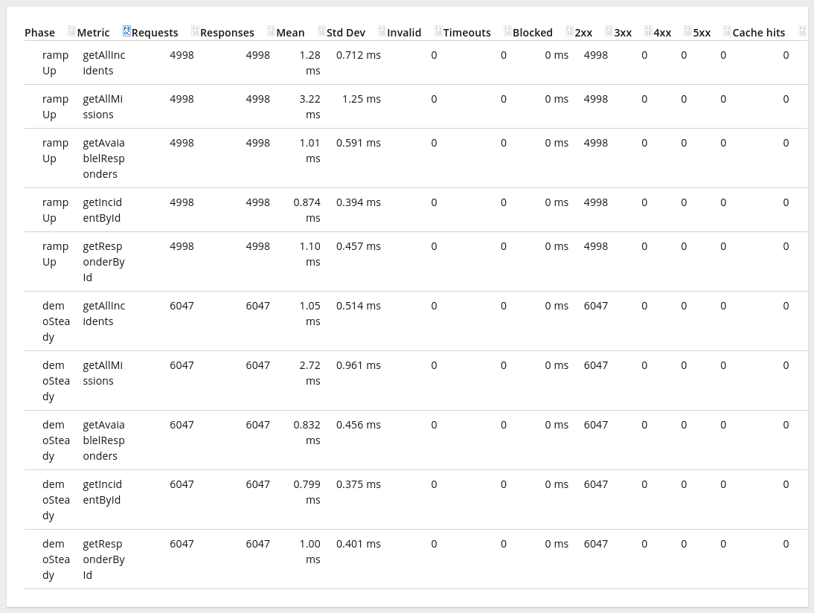

# frdemo-contention-reproducer
First Responder Demo App lock contention reproducer

## Setup

Start Postgres database
```bash
cd setup && ./start-db.sh
```

Start zookeeper server
```bash
cd setup && ./start-zookeeper.sh
```

Start Kafka server
```bash
cd setup && ./start-kafka.sh
```
>[!NOTE]
> The kafka server startup might require some retries

Start the Mapbox mock service to avoid calling public services
```bash
cd setup && ./start-mapbox-mock.sh
```

Start the load simulator
```bash
cd setup && ./start-load-simulator.sh
```

Start the application
```bash
cd setup && ./start-frdemo.sh
```

## Load data

```bash
NUM_RESPONDERS=3 NUM_INCIDENTS=3 ./load-data.sh
```

## Run Benchmark

The benchmark makes using of `jbang` to run a Hyperfoil benchmark that you 
can inspect [here](./benchmark.hf.yaml).

Before starting the benchmark itself, it will attach async-profiler to properly
capture JFR recordings for further analysis.

```bash
./run-benchmark.sh
```

## Analysis

At `/tmp/report.html` you can find the Hyperfoil results so you can check latencies and validate
the results themselves.






At `/tmp/async-profiler-output/standalone_cpu.jfr` you can find the generated JFR recording that you can
inspect using other tools like Java Mission Control (JMC).